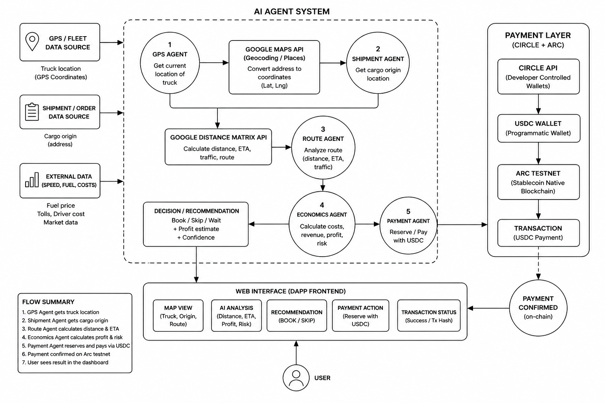
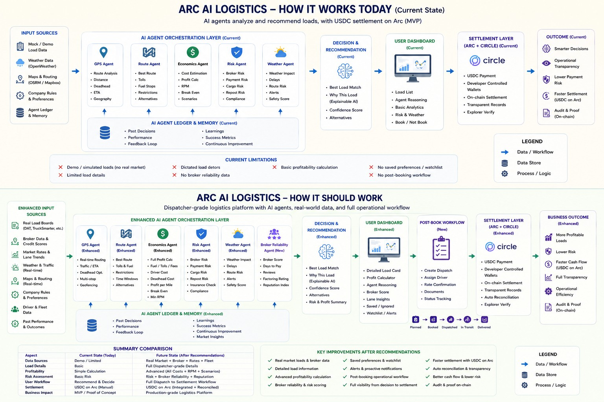

# Arc AI Logistics

AI agents for freight coordination, paid with USDC on Arc.

## Links

- Live Demo: https://arc-ai-logistics.vercel.app/
- Scenario Lab: https://arc-ai-logistics.vercel.app/scenario-lab
- Grant Pitch Page: https://arc-ai-logistics.vercel.app/grant
- Demo Video: https://arc-ai-logistics.vercel.app/demo/arc-ai-logistics-demo.mp4
- Release Notes: [CHANGELOG.md](CHANGELOG.md)

## Overview

Arc AI Logistics is an agentic logistics coordination system where specialized AI agents evaluate freight opportunities and coordinate USDC-denominated paid agent runs using Arc + Circle infrastructure.

The demo combines truck location, load data, routing, economics, weather risk, historical lane intelligence, recommendation logic, and payment proof into one dispatcher workflow. It is designed to show how logistics software can make AI-agent work economically visible and settle agent execution through Circle and Arc.

## Key Features

- AI logistics analysis
- Multi-agent architecture
- Multi-shipment optimization
- Shipment scoring engine
- Ranked load recommendations
- Compare-all-loads view
- Experimental Scenario Lab public demo
- Browser-side CSV upload for Scenario Lab
- CSV-based sample load/truck matching
- Matching metrics, dispatcher notes, and CSV result export
- Simulated shipper contact flow
- Circle USDC payments
- Arc settlement proof
- Explorer verification
- Agent Payment Ledger
- Weather Agent ledger allocation
- Agent Economics Dashboard
- Analytics API
- Per-agent revenue tracking
- Neon/Postgres payment analytics persistence
- Drizzle-managed schema and migrations
- Payment status filtering
- Paginated payment history visibility
- CSV payment export by date range
- OpenWeather Risk Agent with safe fallback
- Historical lane intelligence with preset/mock data
- Gemini-backed recommendations with local fallback logic

## Core Product Principles

Arc AI Logistics is designed around five core product principles:

1. Real live data
   The system should be able to fetch real operational data such as GPS/fleet location, shipment requests, route conditions, delivery status, and external logistics signals.

2. Faster and cheaper economic calculation
   AI agents should calculate profitability, route cost, delivery timing, and operational tradeoffs faster, cheaper, and more consistently than manual dispatch workflows.

3. Option comparison
   The system should compare multiple shipment and fleet options instead of analyzing only one load in isolation.

4. Learning from past experience
   Over time, the system should learn from previous routes, decisions, delays, costs, risks, and outcomes to improve future recommendations.

5. Opportunity discovery and notifications
   The system should suggest promising freight opportunities and notify users when a better load, route, or dispatch decision becomes available.

These principles define the long-term direction of Arc AI Logistics: an AI-agent coordination system that helps transport operators find cargo, evaluate deals, reduce manual work, and improve delivery control.

## Architecture



AI Agent System: GPS, shipment, route, economics, risk, weather, historical lane, and payment agents coordinate freight decisions and prepare paid agent runs through Circle + Arc infrastructure.

## MVP To Production Transition Plan

The current public release (v0.0.5.c) represents the completed MVP phase of Arc AI Logistics.

The next stage focuses on transitioning from a demonstration-oriented AI-agent coordination system toward a more dispatcher-grade operational platform with:

- richer load details,
- broker/payment reliability analysis,
- post-booking workflow orchestration,
- enhanced profitability modeling,
- real-world operational data integrations,
- and deeper stablecoin-native settlement visibility.

The diagram below summarizes the current MVP architecture and the planned production-oriented evolution path.



## Current Demo Flow

Truck
-> Load
-> Agent Analysis
-> BOOK / WAIT / SKIP
-> Circle Payment
-> Arc Settlement
-> Explorer Proof
-> Analytics Dashboard

The current demo starts with 3 preset US dry van trucks and 10 preset US dry van loads across Texas, Illinois, and Georgia. Agents evaluate routing, economics, risk, weather, lane history, and payment proof before surfacing dispatch recommendations and analytics.

## Scenario Lab

Scenario Lab is an experimental public demo route at `/scenario-lab`. It is a safe local sandbox for dispatcher-focused truck/load matching tests using sample or uploaded CSV data. It is not a live dispatch platform, not a real GPS integration, and does not contact real brokers or shippers.

Scenario Lab supports browser-only CSV workflows:

- Download the bundled sample loads and trucks CSV files.
- Load the 50-load and 5-truck sample scenario.
- Upload local loads and trucks CSV files with the expected headers.
- Parse and validate CSV rows in the browser.
- Show readable row-level warnings for skipped or invalid rows.
- Reset the scenario state without backend writes.

The bundled sample CSV files live in `public/sample-data/`:

- `sample_loads_50.csv` contains 50 sample loads.
- `sample_trucks_5.csv` contains 5 sample trucks.

Matching recommendations require equipment compatibility, reject overweight loads, estimate empty miles with a haversine distance calculation, estimate truck cost, estimate profit, score each match from 0 to 100, and return 0-3 positive-profit recommendations per truck. The page also shows matching metrics, deterministic "Why this match?" explanations, dispatcher notes, and a browser-only CSV export for computed matching results.

Scenario Lab is local simulation only. It does not create a paid agent run, call Gemini, persist records to Neon, write dashboard analytics, create dashboard records, or create Circle payments. The Contact shipper action is disabled and simulated; it does not send messages or call any real API.

Scenario Lab is a foundation for future user-controlled data workflows. The intended next step is to connect Scenario Lab runs to the existing paid agent workflow, payment records, and dashboard observability.

## Why Arc + Circle

Arc provides stablecoin-native infrastructure suited for programmable settlement and payment proof. USDC is used as the unit of account for paid agent execution.

Circle Developer Controlled Wallets power the current server-side payment flow. A paid agent run creates a real Circle transaction, settles USDC on Arc, returns Circle transaction status, and displays explorer proof when available.

The agent ledger breaks one 0.005 USDC paid analysis into visible work units, preparing the system for future machine-to-machine payment flows without hiding agent execution costs inside the backend. Weather Agent is now represented as its own visible operational signal and ledger allocation while Risk Agent remains the aggregate risk synthesis.

## Agent Payment Ledger

| Agent           |        Cost |
| --------------- | ----------: |
| GPS Agent       |  0.001 USDC |
| Route Agent     | 0.0015 USDC |
| Economics Agent | 0.0015 USDC |
| Risk Agent      | 0.0005 USDC |
| Weather Agent   | 0.0005 USDC |
| Total           |  0.005 USDC |

This matters because it makes AI-agent execution economically visible and prepares the system for machine-to-machine payment flows. Instead of treating AI analysis as a hidden backend cost, the demo shows how each agent task can become a priced, auditable work unit.

## Agent Economics Dashboard

The dashboard shows:

- Total Payments
- Total USDC Spent
- Average Cost per Analysis
- Total Analyses
- Per-agent revenue
- Weather Agent analytics visibility
- Payment status filters for All, Cleared, Pending, and Failed records
- Paginated payment history through the existing analytics data source
- CSV export for payment records matching an optional date range
- Circle transaction IDs
- Arc tx hashes
- Explorer proof links

Analytics persistence is backed by Neon/Postgres with a Drizzle-managed schema and migrations. The dashboard no longer relies only on runtime JSON files; the legacy server-side JSON analytics store remains available as an isolated compatibility fallback. v0.0.4.b improves visibility into Pending, Failed, and Cleared payment lifecycle states without changing payment execution logic.

## Current Release

v0.0.5.c - 2026-06-03

Release highlights:

- Added Weather Agent ledger allocation visibility
- Added Weather Agent analytics visibility across paid agent economics surfaces
- Updated public release/documentation surfaces for Weather Agent operational role
- Aligned visible release references to v0.0.5.c
- Kept total paid analysis bundle at exactly 0.005 USDC
- Kept Risk Agent as aggregate risk synthesis
- No changes to runtime logic, Circle payment flow, database schema, migrations, analytics logic, dashboard functionality, or Scenario Lab behavior
- Added homepage access to Scenario Lab as an experimental local simulation
- Added Scenario Lab dispatcher UX improvements
- Added Scenario Lab matching metrics
- Added deterministic Why this match explanations
- Added dispatcher notes for recommendations
- Added browser-only CSV export for Scenario Lab matching results
- Added dispatcher explainer guide
- Clarified Scenario Lab status as experimental local simulation
- Sample CSV-based local truck/load matching simulation
- Browser-side CSV upload for Scenario Lab data
- 50-load and 5-truck sample dataset
- 0-3 recommendations per truck
- Row-level CSV validation warnings
- Simulated Contact shipper action
- Scenario Lab is not connected to Circle payments, Gemini, Neon persistence, or dashboard observability
- Payment status filtering for All, Cleared, Pending, and Failed records
- Paginated payment history from the existing analytics data source
- CSV export for payment records matching an optional date range
- Improved Pending / Failed / Cleared payment lifecycle visibility
- Neon/Postgres analytics persistence
- Drizzle schema and migrations
- analysis_runs, agent_runs, and payment_records persistence
- Legacy JSON analytics fallback
- Dashboard copy updated for database-backed analytics
- Autonomous Multi-Shipment Optimization
- Shipment scoring engine
- Ranked load recommendations
- Compare-all-loads view
- Agent Economics Dashboard
- Analytics API
- Per-agent revenue tracking
- Payment analytics persistence
- Improved payment proof visibility
- Improved dashboard presentation

## Current Status

- Live public demo: COMPLETE
- Stage 1 MVP scope: COMPLETE
- AI logistics analysis: COMPLETE
- Multi-agent recommendation flow: COMPLETE
- Multi-shipment optimization: COMPLETE
- Scenario Lab MVP: COMPLETE
- Scenario Lab public demo access: COMPLETE
- Scenario Lab browser CSV upload: COMPLETE
- Scenario Lab CSV result export: COMPLETE
- Agent Payment Ledger: COMPLETE
- Weather Agent ledger allocation: COMPLETE
- Circle DCW payment flow: COMPLETE
- Real USDC settlement on Arc: COMPLETE
- Explorer proof display: COMPLETE
- Agent Economics Dashboard: COMPLETE
- Payment status filtering: COMPLETE
- CSV payment export: COMPLETE
- Neon/Postgres analytics persistence: COMPLETE
- Grant pitch page: COMPLETE
- Embedded demo video: COMPLETE
- Scenario Lab paid agent workflow connection: NEXT
- Manual load entry/import: NEXT
- Autonomous dispatch workflows: NEXT

## Data and Integrations

- Google Routes is used for server-side routing when configured, with safe fallback miles when unavailable.
- OpenWeather is used server-side through `OPENWEATHER_API_KEY`; the key is never exposed to the browser.
- Weather Agent represents OpenWeather/fallback weather intelligence as a visible operational signal and separate paid ledger allocation.
- The app runs safely without `OPENWEATHER_API_KEY` by using fallback weather risk.
- Gemini is used for AI dispatch recommendations when configured, with local fallback recommendation logic when unavailable.
- Scenario Lab uses bundled sample CSV files, user-uploaded CSV files, and local browser-side matching only; it is not connected to Circle payments, Gemini, Neon persistence, or dashboard observability yet.
- Historical lane intelligence is preset/mock data for Texas, Illinois, and Georgia lanes.
- Fuel prices are preset by state for the MVP and do not call a paid fuel API.
- Circle Developer Controlled Wallets are used for server-side USDC payment execution.
- Arc settlement proof is displayed through tx hash and explorer links when returned by Circle.
- Neon/Postgres stores analytics persistence through Drizzle-managed schema and migrations.
- Runtime JSON analytics remains available only as a legacy fallback.
- Load board APIs are intentionally deferred; manual load entry and import are planned later.

## Known Limitations

- Demo truck and load data is preset.
- Scenario Lab is an experimental local simulation, not a live dispatch platform.
- Scenario Lab does not use live GPS, ELD, TMS, or load-board integrations.
- Scenario Lab matching is local browser-side simulation only.
- Scenario Lab does not persist runs to Neon, call Gemini, create Circle payments, or create dashboard records.
- Scenario Lab contact actions are simulated and do not contact real brokers or shippers.
- Historical lane intelligence is preset/mock data.
- Analytics persistence is database-backed, with runtime JSON retained only as a fallback.
- Weather risk is intentionally conservative and uses fallback behavior when live weather is unavailable.
- Load board integrations, user accounts, and manual load entry are deferred.
- The system remains dispatcher-first; AI recommends, while humans decide.

## Future Roadmap

- Connect Scenario Lab runs to the paid agent workflow, payment records, and dashboard observability
- Manual load entry and CSV import
- Durable analytics storage
- Broker and lane history database
- External GPS / ELD integration
- Load board data import
- Notification workflows for better opportunities
- Emergency dispatch mode
- AI provider abstraction
- More autonomous multi-load dispatch workflows
- Machine-to-machine logistics coordination on Circle + Arc

## Project Notes

- [Future architecture notes](docs/FUTURE_IDEAS.md) - deferred ideas, resilience scenarios, AI provider abstraction, emergency dispatch mode, and future marketplace concepts.

## Tech Stack

- Next.js App Router
- TypeScript
- Tailwind CSS
- Google Maps
- Google Routes
- OpenWeather
- AI agent orchestration / Gemini
- Circle Developer Platform
- Arc Testnet
- Neon/Postgres
- Drizzle ORM
- Vercel

## Local Development

```bash
npm install
npm run dev
```

Required environment variables, without values:

```env
NEXT_PUBLIC_GOOGLE_MAPS_API_KEY=
GOOGLE_MAPS_SERVER_API_KEY=
GEMINI_API_KEY=
OPENWEATHER_API_KEY=
CIRCLE_API_KEY=
CIRCLE_ENTITY_SECRET=
DATABASE_URL=
DEV_DATABASE_URL=
```

Local development and production use `DATABASE_URL`. Vercel Preview deployments
use `DEV_DATABASE_URL` when `VERCEL_ENV=preview`.

Never commit `.env.local`, API keys, entity secrets, wallet secrets, database URLs, or private keys.

## Grant Reviewer Note

Arc AI Logistics is a live demo and grant-ready prototype showing AI logistics analysis, USDC-denominated paid agent execution, real Circle DCW payments, Arc settlement proof, payment analytics, Weather Agent ledger allocation visibility, and an experimental Scenario Lab sandbox for browser-side CSV logistics matching. The next step is to move from preset demo data and local CSV simulation toward durable production data, stronger history storage, and more autonomous dispatch workflows.

## Circle Product Feedback

### Why these products were chosen

Arc AI Logistics was designed around programmable stablecoin-native operational workflows, where AI agents can coordinate logistics analysis, recommendation generation, and settlement visibility using onchain infrastructure.

Circle Developer Controlled Wallets were chosen because they provided a practical way to demonstrate real AI-agent payment orchestration without requiring direct end-user wallet management.

USDC was selected as the operational settlement asset because predictable denomination and stable value are important for logistics-oriented workflows and per-agent economic accounting.

Arc was chosen because the network is specifically positioned around programmable stablecoin infrastructure and real-time operational coordination.

### What worked well during development

- Circle Developer Controlled Wallet onboarding and API structure were relatively straightforward for MVP integration.
- Arc settlement confirmation flows were easy to demonstrate operationally in a live demo environment.
- Stablecoin-denominated agent economics made it easier to model transparent per-agent operational costs.
- Circle documentation and example flows made early experimentation significantly easier for a solo builder environment.

### What could be improved

- More end-to-end examples focused specifically on AI-agent orchestration workflows would be valuable.
- Operational observability around payment lifecycle debugging could be expanded further.
- More examples covering production-style multi-agent economic coordination patterns would help developers move from demo systems toward operational deployments.

### Recommendations

- More reference architectures for agentic commerce systems would help builders entering the ecosystem.
- Additional examples around micropayment coordination, autonomous workflows, and AI-agent payment and settlement loops could significantly improve developer onboarding.
- More logistics and operational workflow examples could help demonstrate stablecoin infrastructure outside traditional fintech use cases.
